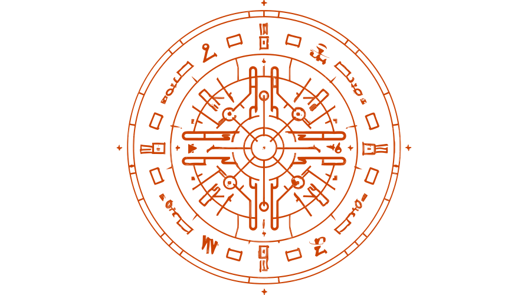

# Cipherbox
## Minimalistic Go Encryption Library that wraps chacha20poly1305 cipher and scrypt hash algorithm.

This is library aims to simplify encryption and decryption capabilities using the [chacha20poly1305](https://pkg.go.dev/golang.org/x/crypto/chacha20poly1305) and [scrypt](https://pkg.go.dev/golang.org/x/crypto/scrypt) hash algorithms. It is designed to handle both chunks and streams of data, and can be used either as a library or as a command line tool located in the [cmd/cipherCli](cmd/cipherCli) directory. The library is intended to be user-friendly and easy to integrate into existing projects, while providing robust encryption and decryption functionality.

## Library usage

### Chunks
```go
package main

import (
	"bytes"
	"log"

	cipher "github.com/8ff/cipherbox"
)

func main() {
	data := []byte("Hello world")
	key := make([]byte, cipher.ParamDefaults.KeySize)
	// Set key to some long phrase that is of key size
	copy(key, []byte("This is a long phrase that is of key size"))

	// Initialize cipher
	c, err := cipher.Init(cipher.Params{Key: key})
	if err != nil {
		log.Fatalf("Failed to initialize cipher: %v", err)
	}

	// Encrypt data
	encrypted, err := c.Encrypt(data)
	if err != nil {
		log.Fatalf("Failed to encrypt data: %v", err)
	}

	// Decrypt data
	decrypted, err := c.Decrypt(encrypted)
	if err != nil {
		log.Fatalf("Failed to decrypt data: %v", err)
	}

	// Verify that decrypted data is the same as original data
	if !bytes.Equal(data, decrypted) {
		log.Fatalf("Decrypted data is not the same as original data")
	}

	// Print Input and decrypted string
	log.Printf("Input: %s\n", data)
	log.Printf("Decrypted: %s\n", decrypted)
}
```

## Command line usage
```bash
foo@bar:~$ cd cmd/cipherCli
foo@bar:~$ cipherCli % echo test | CKEY=test go run cipherCli.go e | CKEY=test go run cipherCli.go d
test
```

## Streams
The StreamEncrypt and StreamDecrypt functions can be used to encrypt or decrypt large amounts of data in a streaming fashion, without having to load the entire data into memory at once. These functions take an io.Reader as input and an io.Writer as output, and encrypt or decrypt the data in chunks of a specified size.

Here's an example of how to use the StreamEncrypt and StreamDecrypt functions:
```go
package main

import (
    "bytes"
    "io"
    "log"
    "os"

    cipher "github.com/8ff/cipherbox"
)

func main() {
    key := make([]byte, cipher.ParamDefaults.KeySize)
    // Set key to some long phrase that is of key size
    copy(key, []byte("This is a long phrase that is of key size"))

    // Initialize cipher
    c, err := cipher.Init(cipher.Params{Key: key})
    if err != nil {
        log.Fatalf("Failed to initialize cipher: %v", err)
    }

    // Encrypt data from stdin and write to stdout
    if err := c.StreamEncrypt(os.Stdin, os.Stdout, 1024*10); err != nil {
        log.Fatalf("Failed to encrypt data: %v", err)
    }

    // Decrypt data from stdin and write to stdout
    if err := c.StreamDecrypt(os.Stdin, os.Stdout, 1024*10); err != nil {
        log.Fatalf("Failed to decrypt data: %v", err)
    }
}
```

In this example, we initialize the cipher using the Init function, and then use the StreamEncrypt and StreamDecrypt functions to encrypt or decrypt data from os.Stdin and write the result to os.Stdout. We use a chunk size of 10240 bytes (10KB) for both functions.
Note that the StreamEncrypt and StreamDecrypt functions handle reading and writing data in chunks automatically, so there's no need to manually read or write data in a loop.

## Command line usage
```bash
foo@bar:~$ cd cmd/streamCli
foo@bar:~$ streamCli % echo test | CKEY=test go run streamCli.go e | CKEY=test go run streamCli.go d
test
```